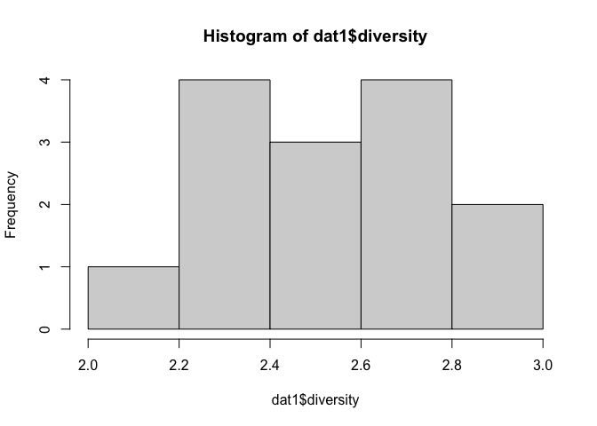
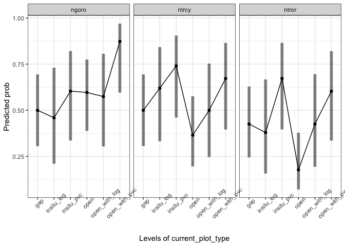

log-project-western-australia
================
July 2022

<div class="Box">

Understanding how spatial variation is linked to diversity maintenance
in natural communities is a pillar of plant community ecology.
Theoretically, a variable landscape can maintain diversity via niche
partitioning: different species can trade off in performing better or
worse depending on the conditions of the patch they are growing in, and
as a result, more species can sustainably coexist in a community than if
it were spatially heterogeneous. In the hyperdiverse system of native
annual plants in Western Australia, fallen logs may be one of the
greatest contributors to generating spatial variation that could help
maintain species diversity. Considerable anecdotal evidence suggests
that fallen logs generate spatial variation, or patchiness, in the
environment (Figure 1), and that species or assemblages of plants may
respond differently depending on if they are near logs or not. Despite
such anecdotal evidence, it is yet unknown if and how fallen logs
contribute to maintaining species diversity in the native annual plant
communities of the Western Australian wheat belt.

</div>

<center>

<figure>

<figcaption aria-hidden="true">Figure 1: image of annual plant halos
around logs</figcaption>
</figure>

</center>

The project will address the following questions:

**1) Are/how are plant communities in fallen log patches different from
patches that are in the open?**

**2) Why are plant communities in fallen log patches different from
patches in the open?**

**3) Are plant species performances affected by proximity to fallen
logs?**

### Hypotheses

The null hypothesis, H0, is that annual plants in fallen log patches are
not different in diversity, abundance, or composition from open patches.

In addition to the null hypothesis, the following constitute four,
non-mutually exclusive hypotheses concerning how fallen logs may
introduce spatial variation in the environment. I include corresponding
predictions for how plant communities may differ between fallen log
patches as compared to open patches. <br><br> **H1: Log decomposition
creates islands of fertility directly around the fallen log.** <br>
Prediction 1: Nutrient composition around logs will be higher than in
open plots <br>

Prediction 2: Variation in nutrient composition in log vs open
environments will correspond to variation in species composition,
abundance, and/or richness in these environments. <br>

Prediction 3: All sown plants will perform best in environments where
organic logs have been left ‘insitu’. In locations where logs have been
removed or replaced with pvc, the legacy of the nutrient island effect
will yield higher sown plant performance than when compared to locations
where logs have never been. The effect of the nutrient island in
locations where logs have been added to open environments should yeild
higher plant performance over time. *note: performance is measured in
terms of germination rate, survival to fruiting, fecundity, and/or
biomass.* <br><br>

**H2: Fallen logs alter the microclimate directly around them by
providing shade.**<br> Prediction 1: Shade and temperature around logs
vs in open plots will be different <br>

Prediction 2: Variation in shade and temperature in log vs open
environments will correspond to variation in species composition,
abundance, and/or richness in these environments. <br>

Prediction 3: All sown plants will perform best in environments where
there are organic or pvc logs, no matter if they have been recently
moved or not.<br><br>

**H3: Fallen logs trap dispersing seeds as they are blown along the
ground.**<br>

Prediction 1: Dispersing seeds accumulate around logs, leading to a
denser stand of plants in fallen log patches. Plant abundance in fallen
log patches will be higher as compared to open patches. Rare plants will
be more common in fallen log patches as compared to open patches <br>

Prediction 2: All sown plants will perform the same in all experimental
environments <br><br>

**H4: At least some species perform differently according to variation
in log vs. open environments and have short dispersal kernals, causing
fitness-density covariance** <br><br>
<center>

<figure>

<figcaption aria-hidden="true">Figure 2: Photo before germination, after
a rain. Notice the seeming wet halo under and around the
branch</figcaption>
</figure>

</center>

### Experimental Design

In this experiment, 224 plots are arranged in 7 blocks of 32 plots each
within the Caron Dam nature reserve. [A map can be found
here](https://www.google.com/maps/d/edit?mid=1z6w6tScsCcKSpsdUmoupfOJVaaq16VYk&usp=sharing).
<br>*note: the location info for 3.02 is probably incorrect as of May
2022, and location info is currently unavailable for plots 6.25 and
7.19*

Each block is approximately 30m X 30m in area. Plots are 1m long and
linear, and have a pin tag on either end (see Figure 3). The pin tags
have the identity of the plot written on them in the form of
“blocknumber.plotnumber”. Plots are 1m or more away from each other.

In each block, plot environments can be one of six types:<br> - A 1m log
that is out in the open (open_with_log, 4 plots) <br> - A 1m log that is
a part of a tree (insitu_log, 4 plots)<br> - A 1m pvc pipe that is out
in the open (open_with_pvc, 4 plots)<br> - A 1m pvc pipe that is a part
of a tree (insitu_pvc, 4 plots)<br> - A plot that is out in the open
(open, 8 plots) <br> - A gap in a log where a log used to be (gap, 8
plots)<br>

In half of the plots (not including open plots),the addition, exchange,
or removal of logs or pvc to the environment was implemented in October
2020, before seed dispersal. In the other half of these plots, these
manipulations were implemented after seed dispersal, in March 2021.

Within each 1m long plot, there is a \~20cm long microtransect. The ends
of the microtransects are marked by a nail and a washer sunken into the
ground. Each microtransect is approximately 21 cm in internal length
from inner washer edge to inner washer edge. Microtransects are not
sided.

In half of all plots, seeds were sown in March 2021 and February 2022.
In these plots, 15 seeds each of Trachymene ornata (TROR), Goodenia
rosea (GORO), and Trachymene cyanopetala (TRCY) are sown outside of the
microtransects as in the corresponding diagram. These plants were
selected because they represent plants common to communities next to
logs (TROR), out in the open (GORO), or both (TRCY). The plots where
seeds were sown are called ‘lambda’ plots as noted in Figure 3.

<center>

<figure>

<figcaption aria-hidden="true">Figure 3: plot schematic</figcaption>
</figure>

</center>

### Datasets

There are two sets of data that I have collected since the project
began.

1)  Community data, before and after the experiment was implemented.
    Every year during peak biomass we surveyed plant communities at
    every centimeter along each microtransect. Plant count and identity
    information is collected at each centimeter. These data are
    available from 2020 (before the experiment began) and 2021 (one year
    into the experiment).

2)  Performance data of TROR, TRCY, and TROR. In 2021, the only
    performance data that were collected after sowing the experiment
    were the total number of plants that came up and survived to
    fruiting for each species in each location, as well as their total
    biomass. This was because of logistical issues due to covid. In
    2022, no performance data has been collected yet. I am planning on
    collecting germination rate, survival over the season, and
    fecundity.

### Preliminary analysis

##### 1) Are/how are plant communities in fallen log patches different from patches that are in the open? <br>

The ways I have looked at this so far are to compare the initial
composition of annual plant communities in log vs. open plots before we
implemented the experiment. I am suppressing the display of most of the
data wrangling code in the output in the following stuff, but if you’d
like to see you can take a look at what’s in the .Rmd file.

**Abundance** <br> First, I look at the abundance of microtransect
plants in log vs open plots in 2020. For this analysis, I include all
plants including unknown plants. I find that log transects have
marginally significantly more plants than open transects, but it really
is a marginal difference (mean difference is approximately a half a
plant).

``` r
# look at plant abundance in log vs open 

# look at range of data - what family should i use? 
range(dat$total)
```

    ## [1] 0 6

``` r
## using poisson. including random effects throws is.Singular error: see ?is.Singular for details
abun.mod<-glm(total~init, data=dat, family='poisson') 
summary(abun.mod)
```

    ## 
    ## Call:
    ## glm(formula = total ~ init, family = "poisson", data = dat)
    ## 
    ## Deviance Residuals: 
    ##     Min       1Q   Median       3Q      Max  
    ## -2.3549  -0.4886  -0.2693   0.3690   1.9440  
    ## 
    ## Coefficients:
    ##             Estimate Std. Error z value Pr(>|z|)    
    ## (Intercept)  1.01983    0.05726  17.811   <2e-16 ***
    ## initopen    -0.14211    0.08381  -1.696   0.0899 .  
    ## ---
    ## Signif. codes:  0 '***' 0.001 '**' 0.01 '*' 0.05 '.' 0.1 ' ' 1
    ## 
    ## (Dispersion parameter for poisson family taken to be 1)
    ## 
    ##     Null deviance: 174.65  on 220  degrees of freedom
    ## Residual deviance: 171.77  on 219  degrees of freedom
    ## AIC: 769.56
    ## 
    ## Number of Fisher Scoring iterations: 4

``` r
# the difference between open and log environments is marginal, where log has marginally significantly more plants. it's not a lot though. The model-estimated difference is like half a plant. 
emmeans(abun.mod, ~init, type='response')
```

    ##  init rate    SE  df asymp.LCL asymp.UCL
    ##  log  2.77 0.159 Inf      2.48      3.10
    ##  open 2.41 0.147 Inf      2.13      2.71
    ## 
    ## Confidence level used: 0.95 
    ## Intervals are back-transformed from the log scale

``` r
# here's a quick and dirty plot of model estimated means and CIs for abundance in each kind of plot.
emmip(abun.mod, ~init, type='response', CI=T)+theme_bw()+labs(x="Initial condition", y="Number of plants")
```

<!-- -->

``` r
# can also look at presence absence but it's really only a few zeros - no significant difference here.
abun.mod2<-glm(presence~init, data=dat, family='binomial')
summary(abun.mod2)
```

    ## 
    ## Call:
    ## glm(formula = presence ~ init, family = "binomial", data = dat)
    ## 
    ## Deviance Residuals: 
    ##     Min       1Q   Median       3Q      Max  
    ## -3.0690   0.1345   0.1345   0.3050   0.3050  
    ## 
    ## Coefficients:
    ##             Estimate Std. Error z value Pr(>|z|)    
    ## (Intercept)   3.0445     0.4577   6.651 2.91e-11 ***
    ## initopen      1.6560     1.1039   1.500    0.134    
    ## ---
    ## Signif. codes:  0 '***' 0.001 '**' 0.01 '*' 0.05 '.' 0.1 ' ' 1
    ## 
    ## (Dispersion parameter for binomial family taken to be 1)
    ## 
    ##     Null deviance: 55.112  on 220  degrees of freedom
    ## Residual deviance: 52.090  on 219  degrees of freedom
    ## AIC: 56.09
    ## 
    ## Number of Fisher Scoring iterations: 7

**Diversity**<br> Next, I look at the diversity of microtransect plants
in log vs open plots in 2020. For the below analysis, I take a
conservative approach and only include known species, because most of
the unknown species were a result of not being able to differentiate
between known species. Diversity is Shannon’s diversity index and
estimated by pooling the species in each treatment type in each block
(N=14). Shannon’s diversity is not different between the two
environments.

``` r
# what does our data look like? 
hist(dat1$diversity) # pretty normal!
```

<!-- -->

``` r
## model, this time I can add a random effect for block. diversity in this case is shannon's diversity of each transect 
div.mod<-lmer(diversity~init+(1|block), data=dat1)

# summary 
summary(div.mod)
```

    ## Linear mixed model fit by REML ['lmerMod']
    ## Formula: diversity ~ init + (1 | block)
    ##    Data: dat1
    ## 
    ## REML criterion at convergence: 1.8
    ## 
    ## Scaled residuals: 
    ##     Min      1Q  Median      3Q     Max 
    ## -1.3189 -0.5497  0.1992  0.4827  0.9633 
    ## 
    ## Random effects:
    ##  Groups   Name        Variance Std.Dev.
    ##  block    (Intercept) 0.05037  0.2244  
    ##  Residual             0.02004  0.1415  
    ## Number of obs: 14, groups:  block, 7
    ## 
    ## Fixed effects:
    ##             Estimate Std. Error t value
    ## (Intercept)  2.53156    0.10029   25.24
    ## initopen    -0.07487    0.07566   -0.99
    ## 
    ## Correlation of Fixed Effects:
    ##          (Intr)
    ## initopen -0.377

``` r
# plot of difference - not significant. 
emmip(div.mod, ~init, CI=T)+theme_bw()+labs(x="Initial condition", y="Shannon Diversity")
```

<!-- -->

Just for kicks, I can also look at species rarefaction curves, which
tell me how quickly species accumulate in my surveys. I chose to make
curves for all initial treatment X block combinations (14 curves).

<!-- -->

**Dissimilarity** <br> Finally, I can look at how communities are
different in the two different initial treatments - i.e. how different
open vs log locations were before we initiated the experiment. For this
analysis, I do not include unknown species. I do include cases where
there are no individuals in the community.

In the following analysis, I use nonmetric multidimensional scaling,
variance partitioning, redundancy analysis, and partial redundancy
analysis to understand the relative contributions of the initial
treatment (log or open) and block (1-7) to overall community
composition. First, I look at how well initial treatment and block
jointly describe variation in community composition using an rda
analysis.

``` r
#### rda model analysis & results #### 
# can look at significance of model where initial treatment and block explain variation in community
trt_tot<-rda(ass.rel.t0~init+block) # run model using standardized data 
anova.cca(trt_tot) ## test for model significance
```

    ## Permutation test for rda under reduced model
    ## Permutation: free
    ## Number of permutations: 999
    ## 
    ## Model: rda(formula = ass.rel.t0 ~ init + block)
    ##          Df Variance     F Pr(>F)    
    ## Model     7  0.32147 2.626  0.001 ***
    ## Residual  6  0.10493                 
    ## ---
    ## Signif. codes:  0 '***' 0.001 '**' 0.01 '*' 0.05 '.' 0.1 ' ' 1

As you can tell, the overall model of initial treatment+block
significantly explains variation in the data.

I can then look at how initial treatment and block separately describe
variation in community composition using variance partitioning analyses,
and test the significance of the contribution of initial treatment in
explaining variation.

As shown in the varpart venn diagram, the variance partitioning analysis
indicates that the initial treatment only contributes about 8% explained
variation in the full model. We can test if the contribution of initial
treatment is significant using partial redundancy analysis. see `?rda`
for details.

<!-- -->

    ## Permutation test for rda under reduced model
    ## Permutation: free
    ## Number of permutations: 999
    ## 
    ## Model: rda(X = ass.rel.t0, Y = init, Z = block)
    ##          Df Variance      F Pr(>F)  
    ## Model     1 0.036127 2.0657   0.05 *
    ## Residual  6 0.104933                
    ## ---
    ## Signif. codes:  0 '***' 0.001 '**' 0.01 '*' 0.05 '.' 0.1 ' ' 1

Despite only explaining about 8% of variation, the contribution of
initial treatment (open / log) is marginally significant (p-value sits
around 0.05). Log communities and open communities are therefore
marginally significantly different from each other in their overall
composition.

Let’s visualize the differences in the communities using an ordination
plot:
<!-- -->
</center>

In this plot, the points represent blocks, and the colors represent log
vs open initial treatment. Species are represented by a four letter
species code and their position is not jittered. If there is a line
attached to a species code, the other end of the line indicates where
the actual location is in the ordination.

The most apparent result here is that there are two scales of spatial
structure. The points from each block are close together in NMDS space,
which indicates that a lot of the variation comes from large-scale
variation between blocks, where different species are more abundant in
different blocks.

*question - hmmm, can i test this?*

Within blocks, there is also a pattern: the ‘log’ points are
consistently the same direction away from the ‘open’ points in all
cases. In other words, log points are always lower on the x- and/or
y-axes relative to the open points in the same blocks. I take this to
mean that plant species common across all blocks are predictably ‘log’
species or ‘open’ species, and so there is also predictable spatial
structure of plant diversity within blocks, where there are more
‘log-affiliated’ species and more ‘open-affiliated’ species.

*note: in all blocks except 5 and 7, log points are loaded on lower
values on the x- and y-axis as compared to open points; in block 5, the
log point is loaded lower on the x axis and has approximately the same
y-value as the open point; in block 7, the log point is loaded lower on
the y axis only and has approximately the same x-value as the open
point*

A couple things to note here: there were 22 species that didn’t have
loadings in the nmds, perhaps because they were too rare (*note: still
need to look into this*). In this initial analysis, we can see that TROR
falls out as a ‘log’ species, GORO as an ‘open’ species, and TRCY sits
where the two groups overlap, so our intuition about these species was
correct.

##### 2) Why are plant communities in fallen log patches different from patches in the open?

This can be answered by comparing community abundance, diversity, and
dissimilarity among experimental treatments in 2021 and beyond. It can
also be corroborated by looking at environmental correlates to the
changes we observe among treatments as time goes on. I’m not quite sure
how to do this at the moment.

##### 3) How is plant species performance affected by proximity to fallen logs?

This can be answered by comparing performance of sown plants among
experimental treatments in 2021 and beyond.

##### Data overview

In 2021, we sowed 15 seeds of each species into all the different
treatments. The data we collected was the following:

1.  Number of sown individuals growing (out of 15) at peak biomass
2.  Total biomass of sown individuals growing at peak biomass

From these, we can also calculate:

3.  Per-capita biomass of sown individuals.

In 2022, we sowed 15 seeds of each species into all the different
treatments. The data we have collected so far is germination - i.e., the
number of sown seedlings present in July 2022.

##### Modeling

*Response variables* The data from 2021 and 2022 are different, but the
analyses thus far are similar. I can model count data using a
zero-inflated negative binomial model, which accounts for zero inflation
to model total number of individuals in a given location.

I can also use hurdle models to model the *probability of occurrence
each species* (which is binomial), and the *abundance of each species in
the cases where they are present* (this is either a truncated poisson or
truncated negative binomial distribution, so called because it doesn’t
model zeros).

In 2021, I model counts of individuals that both germinated and survived
to flowering. In 2022, the I model the number of seedlings.

I also use generalized linear mixed effects models to model the total
and per-capita biomass of sown individuals from 2021. This is a measure
of performance that acts as proxy for fecundity.

*Control Variables* There are multiple control variables we can use to
predict the presence and abundance of individuals.

1.  **Plot type**, which has seven levels and is the experimental
    treatment.
2.  **Log legacy**, which has two levels and groups treatments according
    to the initial state of the plot before the experiment was
    installed - was it a plot that originally had a log, or was out in
    the open with no log?
3.  **Physical barrier**, which has two levels. This groups treatments
    according to if the experimental treatment is either a physical
    barrier (pvc or log), or there is not (- either a ‘gap’ where the
    log has been removed, or open)

##### 2021

<div class="Box">

###### Summary of 2021 statistically significant results

**Plot type analysis**  
- GORO abundance is marginally significantly higher in open with pvc
plots than insitu log plots  
- The probability of TROR presence in insitu pvc plots is significantly
higher than the probability of TROR presence in open plots

**Log legacy analysis**  
- Count and total biomass of TRCY is marginally significantly higher in
log-legacy plots as compared to open-legacy plots

**Physical barrier analysis**  
- TROR and TRCY are significantly more likely to occur where there is a
physical barrier  
- GORO has significantly higher per-capita biomass when there is a
physical barrier

</div>

###### Response of counts and biomass to plot type

First we can look at the results from the zero-inflated model that
predicts the *end-result, final counts of individuals in each plot
type*. What we observe is **G. rosea counts are marginally singificantly
higher in open with pvc plots than insitu log plots**

``` r
# visualize
emmip(fit3,~current_plot_type|name, type='response',CI=T)+
  theme_bw()+
  theme(axis.text.x = element_text(angle = 45))
```

<!-- -->

``` r
# visualize
est<-emmeans(fit3,~current_plot_type|name, type='response')
pairs(est)
```

    ## name = ngoro:
    ##  contrast                      ratio    SE  df null t.ratio p.value
    ##  gap / insitu_log              2.899 1.552 297    1   1.988  0.3515
    ##  gap / insitu_pvc              1.022 0.459 297    1   0.048  1.0000
    ##  gap / open                    1.049 0.422 297    1   0.118  1.0000
    ##  gap / open_with_log           1.269 0.642 297    1   0.471  0.9971
    ##  gap / open_with_pvc           0.695 0.286 297    1  -0.884  0.9501
    ##  insitu_log / insitu_pvc       0.352 0.199 297    1  -1.844  0.4394
    ##  insitu_log / open             0.362 0.191 297    1  -1.929  0.3864
    ##  insitu_log / open_with_log    0.438 0.263 297    1  -1.376  0.7416
    ##  insitu_log / open_with_pvc    0.240 0.124 297    1  -2.769  0.0654
    ##  insitu_pvc / open             1.026 0.445 297    1   0.060  1.0000
    ##  insitu_pvc / open_with_log    1.242 0.668 297    1   0.402  0.9986
    ##  insitu_pvc / open_with_pvc    0.680 0.307 297    1  -0.856  0.9565
    ##  open / open_with_log          1.210 0.590 297    1   0.391  0.9988
    ##  open / open_with_pvc          0.663 0.266 297    1  -1.027  0.9086
    ##  open_with_log / open_with_pvc 0.548 0.270 297    1  -1.220  0.8268
    ## 
    ## name = ntrcy:
    ##  contrast                      ratio    SE  df null t.ratio p.value
    ##  gap / insitu_log              0.951 0.412 297    1  -0.117  1.0000
    ##  gap / insitu_pvc              1.286 0.498 297    1   0.650  0.9870
    ##  gap / open                    1.803 0.798 297    1   1.332  0.7670
    ##  gap / open_with_log           1.374 0.663 297    1   0.659  0.9862
    ##  gap / open_with_pvc           2.034 0.859 297    1   1.680  0.5464
    ##  insitu_log / insitu_pvc       1.353 0.599 297    1   0.682  0.9838
    ##  insitu_log / open             1.897 0.913 297    1   1.329  0.7687
    ##  insitu_log / open_with_log    1.446 0.799 297    1   0.667  0.9854
    ##  insitu_log / open_with_pvc    2.139 1.015 297    1   1.603  0.5972
    ##  insitu_pvc / open             1.402 0.625 297    1   0.758  0.9742
    ##  insitu_pvc / open_with_log    1.069 0.536 297    1   0.133  1.0000
    ##  insitu_pvc / open_with_pvc    1.582 0.683 297    1   1.061  0.8962
    ##  open / open_with_log          0.762 0.424 297    1  -0.488  0.9966
    ##  open / open_with_pvc          1.128 0.542 297    1   0.251  0.9999
    ##  open_with_log / open_with_pvc 1.480 0.788 297    1   0.736  0.9773
    ## 
    ## name = ntror:
    ##  contrast                      ratio    SE  df null t.ratio p.value
    ##  gap / insitu_log              1.253 0.787 297    1   0.359  0.9992
    ##  gap / insitu_pvc              0.549 0.255 297    1  -1.289  0.7908
    ##  gap / open                    0.637 0.373 297    1  -0.771  0.9722
    ##  gap / open_with_log           0.936 0.523 297    1  -0.119  1.0000
    ##  gap / open_with_pvc           0.967 0.439 297    1  -0.074  1.0000
    ##  insitu_log / insitu_pvc       0.438 0.275 297    1  -1.316  0.7759
    ##  insitu_log / open             0.508 0.368 297    1  -0.936  0.9370
    ##  insitu_log / open_with_log    0.747 0.526 297    1  -0.414  0.9984
    ##  insitu_log / open_with_pvc    0.772 0.477 297    1  -0.419  0.9983
    ##  insitu_pvc / open             1.159 0.680 297    1   0.252  0.9999
    ##  insitu_pvc / open_with_log    1.704 0.962 297    1   0.945  0.9344
    ##  insitu_pvc / open_with_pvc    1.761 0.784 297    1   1.271  0.8004
    ##  open / open_with_log          1.470 0.982 297    1   0.577  0.9925
    ##  open / open_with_pvc          1.519 0.879 297    1   0.722  0.9791
    ##  open_with_log / open_with_pvc 1.033 0.568 297    1   0.060  1.0000
    ## 
    ## P value adjustment: tukey method for comparing a family of 6 estimates 
    ## Tests are performed on the log scale

We can use the hurdle model up to look a presence/absence and abundance
separately. What this will show is there is one statistically
significant result- **The probability of TROR presence in insitu pvc
plots is significantly higher than the probability of TROR presence in
open plots**. TROR is also marginally significantly more likely to occur
in open plots with pvc as compared to open plots.

``` r
#visualize
emmip(zerofit,~current_plot_type|name, type='response',CI=T)+
  theme_bw()+
  theme(axis.text.x = element_text(angle = 45))
```

<!-- -->

``` r
# show comparisons
est<-emmeans(zerofit, ~current_plot_type|name, type='response')

pairs(est)
```

    ## name = ngoro:
    ##  contrast                      odds.ratio    SE  df null t.ratio p.value
    ##  gap / insitu_log                   1.175 0.808 317    1   0.235  0.9999
    ##  gap / insitu_pvc                   0.656 0.434 317    1  -0.638  0.9881
    ##  gap / open                         0.676 0.376 317    1  -0.705  0.9812
    ##  gap / open_with_log                0.741 0.499 317    1  -0.446  0.9978
    ##  gap / open_with_pvc                0.145 0.125 317    1  -2.246  0.2198
    ##  insitu_log / insitu_pvc            0.558 0.437 317    1  -0.745  0.9761
    ##  insitu_log / open                  0.575 0.400 317    1  -0.796  0.9681
    ##  insitu_log / open_with_log         0.630 0.500 317    1  -0.582  0.9922
    ##  insitu_log / open_with_pvc         0.123 0.118 317    1  -2.189  0.2460
    ##  insitu_pvc / open                  1.030 0.690 317    1   0.045  1.0000
    ##  insitu_pvc / open_with_log         1.130 0.870 317    1   0.159  1.0000
    ##  insitu_pvc / open_with_pvc         0.221 0.207 317    1  -1.610  0.5927
    ##  open / open_with_log               1.097 0.747 317    1   0.135  1.0000
    ##  open / open_with_pvc               0.215 0.186 317    1  -1.777  0.4819
    ##  open_with_log / open_with_pvc      0.196 0.185 317    1  -1.725  0.5159
    ## 
    ## name = ntrcy:
    ##  contrast                      odds.ratio    SE  df null t.ratio p.value
    ##  gap / insitu_log                   0.612 0.428 317    1  -0.702  0.9816
    ##  gap / insitu_pvc                   0.350 0.248 317    1  -1.483  0.6756
    ##  gap / open                         1.737 0.974 317    1   0.984  0.9227
    ##  gap / open_with_log                1.000 0.668 317    1   0.000  1.0000
    ##  gap / open_with_pvc                0.487 0.331 317    1  -1.059  0.8972
    ##  insitu_log / insitu_pvc            0.571 0.475 317    1  -0.673  0.9848
    ##  insitu_log / open                  2.837 2.017 317    1   1.467  0.6858
    ##  insitu_log / open_with_log         1.633 1.304 317    1   0.614  0.9899
    ##  insitu_log / open_with_pvc         0.796 0.642 317    1  -0.283  0.9998
    ##  insitu_pvc / open                  4.965 3.577 317    1   2.224  0.2296
    ##  insitu_pvc / open_with_log         2.858 2.306 317    1   1.302  0.7839
    ##  insitu_pvc / open_with_pvc         1.393 1.135 317    1   0.407  0.9986
    ##  open / open_with_log               0.576 0.392 317    1  -0.811  0.9654
    ##  open / open_with_pvc               0.281 0.194 317    1  -1.838  0.4428
    ##  open_with_log / open_with_pvc      0.487 0.381 317    1  -0.920  0.9411
    ## 
    ## name = ntror:
    ##  contrast                      odds.ratio    SE  df null t.ratio p.value
    ##  gap / insitu_log                   1.211 0.848 317    1   0.273  0.9998
    ##  gap / insitu_pvc                   0.360 0.245 317    1  -1.499  0.6654
    ##  gap / open                         3.440 2.188 317    1   1.942  0.3785
    ##  gap / open_with_log                1.000 0.675 317    1   0.000  1.0000
    ##  gap / open_with_pvc                0.487 0.323 317    1  -1.083  0.8878
    ##  insitu_log / insitu_pvc            0.298 0.240 317    1  -1.501  0.6640
    ##  insitu_log / open                  2.841 2.185 317    1   1.358  0.7521
    ##  insitu_log / open_with_log         0.826 0.662 317    1  -0.238  0.9999
    ##  insitu_log / open_with_pvc         0.402 0.319 317    1  -1.149  0.8604
    ##  insitu_pvc / open                  9.545 7.181 317    1   2.999  0.0344
    ##  insitu_pvc / open_with_log         2.775 2.178 317    1   1.301  0.7845
    ##  insitu_pvc / open_with_pvc         1.351 1.047 317    1   0.388  0.9988
    ##  open / open_with_log               0.291 0.217 317    1  -1.656  0.5620
    ##  open / open_with_pvc               0.142 0.104 317    1  -2.652  0.0880
    ##  open_with_log / open_with_pvc      0.487 0.375 317    1  -0.934  0.9373
    ## 
    ## P value adjustment: tukey method for comparing a family of 6 estimates 
    ## Tests are performed on the log odds ratio scale

In the abundance analysis, there are no significant differences between
plot types. However, we do see that goro tends to produce fewer plants
in the insitu log plots than any other plot type.

``` r
#visualize
emmip(countfit,~current_plot_type|name, type='response',CI=T)+
  theme_bw()+
  theme(axis.text.x = element_text(angle = 45))
```

<!-- -->

*Not shown: Per-capita and total biomass of sown individuals at peak
biomass did not significantly vary according to plot type*

###### Response of counts and biomass to log legacy

Next we can look at the results from the zero-inflated model that
predict the *end-result, final counts of individuals from initially log
(log legacy) vs open plots*. **The main result is that the abundance of
TRCY individuals is marginally significantly higher in log-legacy plots
as compared to open-legacy plots**. This is driven by changes in
abundance, not presence, where there were more TRCY individuals in log
legacy plots than open legacy plots (analysis not shown).

``` r
fit3_leg<-glmmTMB(value~name*initial+(1 | block), ziformula=~., family=nbinom2(), data=countdat)

## This stuff will just give you the end result counts with the zeros factored in...other code (not shown) demonstrates the results are coming from the abundance part of the model. Occurrence doesn't differ. 
# summary(fit3_leg)

# visualize 
emmip(fit3_leg,~initial|name, type='response',CI=T)+
  theme_bw()
```

<!-- -->

``` r
est<-emmeans(fit3_leg,~initial|name, type='response')

pairs(est)
```

    ## name = ngoro:
    ##  contrast   ratio    SE  df null t.ratio p.value
    ##  log / open 0.835 0.240 321    1  -0.628  0.5305
    ## 
    ## name = ntrcy:
    ##  contrast   ratio    SE  df null t.ratio p.value
    ##  log / open 1.677 0.482 321    1   1.800  0.0729
    ## 
    ## name = ntror:
    ##  contrast   ratio    SE  df null t.ratio p.value
    ##  log / open 1.003 0.363 321    1   0.010  0.9924
    ## 
    ## Tests are performed on the log scale

This result is recapitualted in the model of total biomass of
individuals, where **total biomass of TRCY is marginally significantly
higher in log-legacy plots as compared to open-legacy plots**.

``` r
# weights
totwtmod_leg<-lmer(log_wt~name*initial+(1|block), data=totwtdat)

# model summary
# summary(totwtmod_leg)

# visaulise  
emmip(totwtmod_leg,~initial|name,CI=T)+
  theme_bw()
```

<!-- -->

``` r
# marginal means 
est<-emmeans(totwtmod_leg,~initial|name, type='response')
pairs(est)
```

    ## name = wt_max15_goro:
    ##  contrast   estimate    SE  df t.ratio p.value
    ##  log - open   -0.410 0.300 162  -1.368  0.1733
    ## 
    ## name = wt_max15_trcy:
    ##  contrast   estimate    SE  df t.ratio p.value
    ##  log - open    0.588 0.314 162   1.874  0.0628
    ## 
    ## name = wt_max15_tror:
    ##  contrast   estimate    SE  df t.ratio p.value
    ##  log - open    0.282 0.359 164   0.786  0.4333
    ## 
    ## Degrees-of-freedom method: kenward-roger

*NB: In the biomass analysis, the trend is for goro to have biomass in
open-legacy plots and the Trachymene species to have lower counts and
weights in open-legacy plots.*

###### Response of counts and biomass to physical barriers

We can next look at the results from the physical barrier analyses to
predict *counts of individuals from physical barrier vs no physical
barrier plots*. **The main result is that *Trachymene* species are
significantly more likely to occur where there is a physical barrier**.
Abundance does not vary among species according to if there is a
physical barrier or not.

``` r
#visualize
emmip(zerofit_phys,~physical_barrier|name, type='response',CI=T)+
  theme_bw()
```

<!-- -->

``` r
est<-emmeans(zerofit_phys, ~physical_barrier|name, type='response')
pairs(est)
```

    ## name = ngoro:
    ##  contrast odds.ratio    SE  df null t.ratio p.value
    ##  0 / 1         0.692 0.272 329    1  -0.936  0.3498
    ## 
    ## name = ntrcy:
    ##  contrast odds.ratio    SE  df null t.ratio p.value
    ##  0 / 1         0.439 0.173 329    1  -2.089  0.0375
    ## 
    ## name = ntror:
    ##  contrast odds.ratio    SE  df null t.ratio p.value
    ##  0 / 1         0.390 0.157 329    1  -2.342  0.0198
    ## 
    ## Tests are performed on the log odds ratio scale

Finally, we can look at results from the physical barrier analyses to
predict *total and per-capita biomass*. **The main result is that
*Goodenia* has significantly higher per-capita biomass when there is a
physical barrier**

``` r
# model
pcwtmod_phys<-lmer(log_wt~name*physical_barrier+(1|block), data=pcwtdat)

# visualize
emmip(pcwtmod_phys,~physical_barrier|name,CI=T)+
  theme_bw()
```

<!-- -->

``` r
#test
est<-emmeans(pcwtmod_phys,~physical_barrier|name, type='response')
pairs(est)
```

    ## name = wt_percapita_goro:
    ##  contrast estimate    SE  df t.ratio p.value
    ##  0 - 1      -0.555 0.255 162  -2.177  0.0310
    ## 
    ## name = wt_percapita_trcy:
    ##  contrast estimate    SE  df t.ratio p.value
    ##  0 - 1       0.190 0.273 163   0.698  0.4864
    ## 
    ## name = wt_percapita_tror:
    ##  contrast estimate    SE  df t.ratio p.value
    ##  0 - 1      -0.289 0.313 162  -0.923  0.3575
    ## 
    ## Degrees-of-freedom method: kenward-roger

##### 2022

###### Summary of 2022 statistically significant results

**Plot type analysis**  
- The probability of TRCY occurring in insitu pvc plots is significantly
higher than in open plots.

-   The probability of TRCY occurring in in open with pvc is marginally
    significantly higher than in open plots.

**Log legacy analysis**  
- TRCY abundance is significantly higher in log legacy plots as compared
to open legacy plots

**Physical barrier analysis**  
- TRCY and TROR are significantly more likely to occur in plots with
physical barriers

###### Response of germination to plot type

The results from the hurdle model show that **the probability of TRCY
occurring in insitu pvc plots is significantly higher than in open
plots. It is also marginally more likely to be present in open with pvc
than open plots.** Abundances do not differ for any species across any
treatment.

``` r
zerofit<-glmmTMB(presence~name*current_plot_type+(1 | block), family=binomial, data=dat22)
emmip(zerofit,~current_plot_type|name, type='response',CI=T)+
  theme_bw()+
  theme(axis.text.x = element_text(angle = 45))
```

<!-- -->

``` r
est<-emmeans(zerofit, ~current_plot_type|name, type='response')
pairs(est)
```

    ## name = ngoro_germ:
    ##  contrast                      odds.ratio    SE  df null t.ratio p.value
    ##  gap / insitu_log                   1.175 0.808 317    1   0.235  0.9999
    ##  gap / insitu_pvc                   0.656 0.434 317    1  -0.638  0.9881
    ##  gap / open                         0.676 0.376 317    1  -0.705  0.9812
    ##  gap / open_with_log                0.741 0.499 317    1  -0.446  0.9978
    ##  gap / open_with_pvc                0.145 0.125 317    1  -2.246  0.2198
    ##  insitu_log / insitu_pvc            0.558 0.437 317    1  -0.745  0.9761
    ##  insitu_log / open                  0.575 0.400 317    1  -0.796  0.9681
    ##  insitu_log / open_with_log         0.630 0.500 317    1  -0.582  0.9922
    ##  insitu_log / open_with_pvc         0.123 0.118 317    1  -2.189  0.2460
    ##  insitu_pvc / open                  1.030 0.690 317    1   0.045  1.0000
    ##  insitu_pvc / open_with_log         1.130 0.870 317    1   0.159  1.0000
    ##  insitu_pvc / open_with_pvc         0.221 0.207 317    1  -1.610  0.5927
    ##  open / open_with_log               1.097 0.747 317    1   0.135  1.0000
    ##  open / open_with_pvc               0.215 0.186 317    1  -1.777  0.4819
    ##  open_with_log / open_with_pvc      0.196 0.185 317    1  -1.725  0.5159
    ## 
    ## name = ntrcy_germ:
    ##  contrast                      odds.ratio    SE  df null t.ratio p.value
    ##  gap / insitu_log                   1.211 0.848 317    1   0.273  0.9998
    ##  gap / insitu_pvc                   0.360 0.245 317    1  -1.499  0.6654
    ##  gap / open                         3.440 2.188 317    1   1.942  0.3785
    ##  gap / open_with_log                1.000 0.675 317    1   0.000  1.0000
    ##  gap / open_with_pvc                0.487 0.323 317    1  -1.083  0.8878
    ##  insitu_log / insitu_pvc            0.298 0.240 317    1  -1.501  0.6640
    ##  insitu_log / open                  2.841 2.185 317    1   1.358  0.7521
    ##  insitu_log / open_with_log         0.826 0.662 317    1  -0.238  0.9999
    ##  insitu_log / open_with_pvc         0.402 0.319 317    1  -1.149  0.8604
    ##  insitu_pvc / open                  9.545 7.181 317    1   2.999  0.0344
    ##  insitu_pvc / open_with_log         2.775 2.178 317    1   1.301  0.7845
    ##  insitu_pvc / open_with_pvc         1.351 1.047 317    1   0.388  0.9988
    ##  open / open_with_log               0.291 0.217 317    1  -1.656  0.5620
    ##  open / open_with_pvc               0.142 0.104 317    1  -2.652  0.0880
    ##  open_with_log / open_with_pvc      0.487 0.375 317    1  -0.934  0.9373
    ## 
    ## name = ntror_germ:
    ##  contrast                      odds.ratio    SE  df null t.ratio p.value
    ##  gap / insitu_log                   0.612 0.428 317    1  -0.702  0.9816
    ##  gap / insitu_pvc                   0.350 0.248 317    1  -1.483  0.6756
    ##  gap / open                         1.737 0.974 317    1   0.984  0.9227
    ##  gap / open_with_log                1.000 0.668 317    1   0.000  1.0000
    ##  gap / open_with_pvc                0.487 0.331 317    1  -1.059  0.8972
    ##  insitu_log / insitu_pvc            0.571 0.475 317    1  -0.673  0.9848
    ##  insitu_log / open                  2.837 2.017 317    1   1.467  0.6858
    ##  insitu_log / open_with_log         1.633 1.304 317    1   0.614  0.9899
    ##  insitu_log / open_with_pvc         0.796 0.642 317    1  -0.283  0.9998
    ##  insitu_pvc / open                  4.965 3.577 317    1   2.224  0.2296
    ##  insitu_pvc / open_with_log         2.858 2.306 317    1   1.302  0.7839
    ##  insitu_pvc / open_with_pvc         1.393 1.135 317    1   0.407  0.9986
    ##  open / open_with_log               0.576 0.392 317    1  -0.811  0.9654
    ##  open / open_with_pvc               0.281 0.194 317    1  -1.838  0.4428
    ##  open_with_log / open_with_pvc      0.487 0.381 317    1  -0.920  0.9411
    ## 
    ## P value adjustment: tukey method for comparing a family of 6 estimates 
    ## Tests are performed on the log odds ratio scale

###### Response of germination to log legacy

The results from the zero-inflated model show that **TRCY counts are
significantly higher in log legacy plots as compared to open legacy
plots.** This was driven more by differences in abundance rather than
presence/absence (analysis not shown).

``` r
emmip(fit_leg, ~initial|name, type='response', CI=T)+
  theme_bw()
```

<!-- -->

``` r
est<-emmeans(fit_leg,~initial|name, type='response')
pairs(est)
```

    ## name = ngoro_germ:
    ##  contrast   ratio    SE  df null t.ratio p.value
    ##  log / open  1.27 0.400 315    1   0.771  0.4412
    ## 
    ## name = ntrcy_germ:
    ##  contrast   ratio    SE  df null t.ratio p.value
    ##  log / open  1.77 0.432 315    1   2.340  0.0199
    ## 
    ## name = ntror_germ:
    ##  contrast   ratio    SE  df null t.ratio p.value
    ##  log / open  1.08 0.186 315    1   0.430  0.6675
    ## 
    ## Tests are performed on the log scale

###### Response of germination to physical barriers

The results from the hurdle model show that **TRCY and TROR occurrence
is significantly higher plots with physical barriers.** This resulted in
higher overall counts for TRCY, but not TROR, in the zero-inflated count
model (analysis not shown).

``` r
emmip(zerofit_phys,~physical_barrier|name, type='response',CI=T)+
  theme_bw()
```

<!-- -->

``` r
est<-emmeans(zerofit_phys, ~physical_barrier|name, type='response')
pairs(est)
```

    ## name = ngoro_germ:
    ##  contrast odds.ratio    SE  df null t.ratio p.value
    ##  0 / 1         0.692 0.272 329    1  -0.936  0.3498
    ## 
    ## name = ntrcy_germ:
    ##  contrast odds.ratio    SE  df null t.ratio p.value
    ##  0 / 1         0.390 0.157 329    1  -2.342  0.0198
    ## 
    ## name = ntror_germ:
    ##  contrast odds.ratio    SE  df null t.ratio p.value
    ##  0 / 1         0.439 0.173 329    1  -2.089  0.0375
    ## 
    ## Tests are performed on the log odds ratio scale
